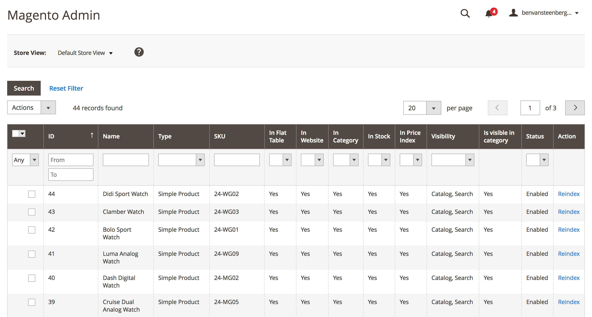
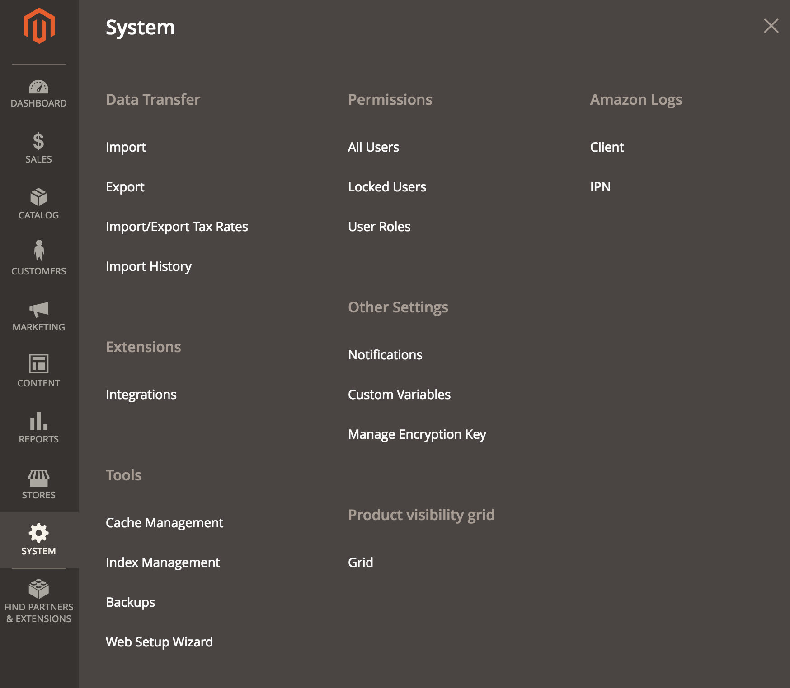

# Magento 2 Product Visibility Grid

**Did you every wonder why your product is not showing up in a category in Magento?**

Magento has a complex way of building a product collection. Due to several conditions, indexes, plugins and other complexities determining whether a product should show is not that straightforward. 

This grid will make your life easier. It shows the different "visibility conditions" in columns and whether a product is or isn't showing up in your category (collection).

* Determine whether a product is showing in category (yes/no)
* Columns per index/condition
* Reindex per product
* Mass reindex selection

<strong>Table of Contents</strong>
* [Magento 1 Version](https://github.com/Itonomy/magento1-product-visibillitygrid)
* [Requirements](#requirements)
* [Installation](#installation)
* [Usage](#️usage)
* [Version](#️version)
* [Credits](#️credits)
* [License](https://github.com/Itonomy/magento2-product-visibillitygrid/blob/master/LICENSE.txt)

# Requirements

- Magento: >= 2.2
- PHP: >= 7.0
- Composer

# Installation

- Add the module to composer:

        composer require itonomy/productvisibilitygrid

- Add the new entry in `app/etc/config.php`, under the 'modules' section:

        'Itonomy_ProductVisibilityGrid' => 1,

- Clear cache
       
        'php bin/magento c:f'

# Usage

        http://[yourstore.net]/[adminslug]/productvisibility/index/grid
        
Or through the menu:

Feel free to contribute and if there are any problems don't hesitate to open an issue.

# Version

- Updated to version 1.0.0 to achieve a first version
- Updated to version 1.0.1 adding readme and fixing bug regarding filtering website/store 
- Updated to version 1.0.2 bugfixes and moving "is_visible_in_cat" to subselect
- Updated to version 1.0.3 bugfixes PHPCS feedback "echo 'a'"
- Updated to version 1.0.4 bugfixes DI compile error
- Updated to version 1.0.5 Update for webshop not using flat tables
- Updated to version 1.0.6 Fix SQL error when no products are in Magento
- Updated to version 1.0.7 Fix for 2.1.8 support and fix for null values in "visible in category"
- Updated to version 1.0.8 Update some documentation, minor fixes.

## Credits

* Jerrol Etheredge (former co-worker who created the M1 version)

## License

[MIT](http://webpro.mit-license.org/)
